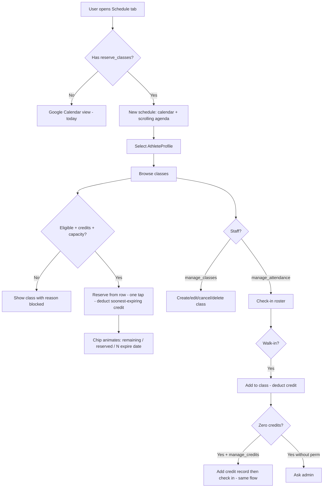

# Class Reservation System — Product Requirements Document

**Version:** 1.2 (client-review updates)  
**Status:** Pre-engineering  
**Scope:** Product and UX requirements only (no implementation specifics)  
**Last updated:** 2026-09-22  
**Client walkthrough:** [CLASS_RESERVATION_WIREFRAMES.md](./CLASS_RESERVATION_WIREFRAMES.md) — MVP screen wireframes and flows (members, coaches, admin)

This document is the **source of truth**. The wireframes describe how MVP screens look and walk; if they ever disagree, update this file first, then the wireframes.

---

## 1. Background and Goals

### Current state

- DC Vault has an older **website** (registration, PayPal payments, quarterly packages, discount codes) and a newer **mobile app** (Expo/React Native).
- Class scheduling today uses **Zen Planner**, which admins update manually when athletes purchase on the website. Members reserve classes in Zen Planner; the app **Schedule tab reads from Google Calendar** for the public practice schedule.
- **Users** have **Athletes** (registration/billing entity) and **AthleteProfiles** (mobile app entity, 1:1 with Athletes). A user may manage **multiple athletes** and switches between them via AthleteProfiles in the app.
- Website registration info explicitly references Zen Planner for reservations and the website calendar for schedule/cancellation updates.


### Product goal

Build a first-party **class reservation system** in the mobile app that eventually replaces Zen Planner, while maintaining continuity with website registration and the existing member experience during a long phased rollout.

### Key objectives

1. Members view schedule, reserve/cancel classes, and see participation — in-app.
2. Staff create/manage classes, check in athletes, and adjust credits when needed.
3. Website purchases flow into the new system and appear correctly in the app.
4. Zen Planner and the existing Google Calendar schedule remain operational until full release.
5. Improve visibility into attendance, remaining classes, and athlete progress.


### Success criteria (launch)

- Beta users with permission can reserve and cancel within policy constraints.
- Website registrations appear in app credit inventory without manual Zen Planner entry (target state before dark launch).
- Staff can manage classes and check-in without external tools (for beta cohort).
- No partial/broken UI for users without permission — they see today's Schedule experience unchanged.


### Phasing philosophy

This is a **multi-phase, multi-session project**. Requirements below distinguish **MVP (dark launch)** from **later phases**. Some engineering design tasks (credit inventory, private lesson payments) are explicitly deferred to dedicated design sessions.

---


## 2. Rollout and Coexistence


### Dark launch (beta)

- New system enabled per-user via `reserve_classes` **permission** (see §13).
- Beta testers use the new Schedule/reservation experience.
- Everyone else sees the **existing Google Calendar Schedule tab** unchanged.
- **Zen Planner continues** for non-beta users and as a fallback until full release.
- Admins continue manually updating Zen Planner for website purchases **until** the new system reliably receives website purchase data.


### Pre-dark-launch requirement

All class **configuration scenarios** (§5) must be supported before dark launch — not necessarily as named "class types," but as configurable class properties that cover every use case.

### Full release (future)

- Zen Planner retired for reservations.
- All members migrated to in-app reservations.
- Communication plan TBD.


### Platform scope


| Capability                        | MVP (dark launch) | Later                                     |
| --------------------------------- | ----------------- | ----------------------------------------- |
| View/reserve classes in app       | Beta users only   | All members                               |
| Website registration → new system | **Required**      | Required                                  |
| In-app registration/payment       | Out of scope      | Full parity with website                  |
| Waivers / registration fields     | Website handles   | App parity when in-app registration ships |


---


## 3. Feature Access


### Decision: permissions only (no feature toggle system)

Use the existing permissions system. No `manage_feature_toggles` or backend toggle infrastructure.

### Member-facing gate

- Permission: `reserve_classes`
- When **granted**: Schedule tab shows the new class reservation experience.
- When **not granted**: Schedule tab shows the **current Google Calendar view** (today's behavior).


### Session behavior

Permission state loads with the user session and refreshes on token refresh (consistent with existing app auth patterns).

---


## 4. Schedule Tab (Member-Facing)


### Purpose

Primary interface for viewing the class schedule and reserving/canceling sessions.

### Views

- **Monthly calendar** at the top (existing pattern) plus a **single scrolling agenda** below.
- **No Upcoming / Past toggle.** Past classes stay in the same list, visually dimmed. By default, load about the **past 2 weeks** plus upcoming classes; older history is reached from profile history (§10), not by paging the Schedule tab infinitely.
- Color-coded class rows (see §5 / §6). Calendar day markers are **not** the class-type color: they distinguish **reserved vs not reserved** for the selected athlete (see below).


### Calendar day indicators

Class-type color lives on the **list rows**, not as the only calendar signal. The month grid needs a **separate** reserved vs unreserved marker, for example:

- Days with at least one reservation for the selected athlete: filled / ringed / check-style marker.
- Days that have bookable classes but no reservation for this athlete: a lighter / outline marker.
- Days with no classes: no marker.

Exact glyph is a visual-design choice; the requirement is that reserved days are distinguishable at a glance without relying on class-type color.

### Display per class

- Title, start/end time, location, description
- Spots remaining / capacity status
- **Eligibility indicator** — if the selected athlete cannot reserve, show **why** (visible but blocked; not hidden)
- Attendance indicator for past classes (for selected athlete — see §10)
- Class note/suggestion field (e.g., pole needed — see §8)


### Credit chip (always visible)

The Schedule header always shows credit status for the selected athlete (not only when remaining is low). It must update immediately after reserve/cancel.

Show:

- **Remaining** — unused credits still available to book.
- **Reserved** — count of upcoming reservations for this athlete (credits already pulled for those spots).
- **Expiring soonest** — how many remaining credits expire on the soonest date, e.g. `4 expire Sep 30` (not only `expires Sep 30`).

Example: `8 remaining · 3 reserved · 4 expire Sep 30`.

On reserve (and cancel, when a credit returns), **animate** the remaining and reserved numbers so the spend is obvious without a confirm sheet (count change, brief emphasis on the chip). Exact motion is a visual-design choice.

### Actions

- **Reserve from the schedule row — one tap, no confirm sheet.** The member does **not** have to open class detail first. Tapping Reserve commits immediately: deduct credit, mark the class Reserved, update the chip with the credit animation. Accidental reserves are undone by canceling within the cutoff (Flow B still uses a confirm, because that returns a credit).
- **Cancel reservation** — within policy window (from the row, detail, or upcoming list). Cancel still asks for confirmation.
- **View class details** — including roster (see below). Opening detail is optional for a normal weekly reserve. Reserve on detail is also one tap (same as the row).
- **Register / buy classes** entry point when athlete has no usable credits (links to registration flow when available; for MVP, may direct to website)


### Capacity

- **Hard stop when full** — no waitlist in MVP.


### Roster visibility

- Attendee **count**, **names**, and **profile photos** visible to users with `view_class_roster` permission.
- MVP: grant this permission to regular members and coaches. Confirmed OK for gym culture for now; can tighten to coaches-only later if needed.
- Tapping a roster entry opens the athlete profile (per existing privacy rules).


### Staff actions (same screen)

Users with `manage_classes` can create/edit classes from the Schedule tab (see §5).

### Empty states

Copy needed for: no upcoming classes, athlete ineligible for all visible classes, athlete has no credits, feature not available (falls back to old calendar — user shouldn't normally see this state).

---


## 5. Class Configurations (Not Formal "Types")


### Approach

Do **not** build a rigid "class types" catalog for MVP. Instead, provide **configuration options** that express all current use cases. **Presets** for common setups (open class, private lesson, break, etc.) may be added later for staff efficiency.

### Configurable properties


| Property                          | Notes                                                                                                         |
| --------------------------------- | ------------------------------------------------------------------------------------------------------------- |
| Title                             |                                                                                                               |
| Description                       |                                                                                                               |
| Start / end time                  | Per occurrence; custom series may use **different times on different days**                                   |
| Location                          |                                                                                                               |
| Allowed athlete groups            | Fly Kids, Open/All Ages, Adult, Elite Development, etc.                                                       |
| Age limits                        | Optional                                                                                                      |
| Recurrence                        | Simple weekly **or custom multi-day** (see below). Edits apply to **single instance** or **entire series**    |
| Reservation cutoff                | Duration **before class start** (e.g. 24 hours before), not a clock time that day                             |
| Cancellation cutoff               | Duration **before class start** (e.g. 24 hours before), not a clock time that day                             |
| Max capacity                      | Single number per class/session                                                                               |
| Cost                              | **Credits and/or money**: credit cost (0, 1, …) and/or dollar cost for paid events / lessons                  |
| Visibility                        | Hidden vs visible on member schedule                                                                          |
| Color                             | Manual or default from athlete group                                                                          |
| `isReservable`                    | `false` for display-only items (meets, breaks)                                                                |
| Requires approval                 | **Not used in MVP.** Private lessons reserve immediately like other classes. Approval flow is Phase 2+        |
| Sends notification on reservation | Available as a class setting; MVP private lessons do not require a special request/approve loop               |
| Coaching staff                    | Multiple; coaches have athlete profiles                                                                       |
| Class note / pole suggestion      | Free-text note shown to members (e.g., "Bring your 14' pole")                                                 |
| Max attendees (lessons)           | Configurable — supports private → semi-private adjustment                                                     |
| Lifecycle                         | **Active**, **canceled** (still on calendar, reversible), or **deleted** (removed, confirmed, not reversible) |


### Behaviors by use case


| Use case                        | MVP behavior                                                                                        |
| ------------------------------- | --------------------------------------------------------------------------------------------------- |
| Open / all-ages classes         | Reservable; group restrictions via config                                                           |
| Age-restricted / group-specific | Reservable; eligibility enforced                                                                    |
| Private lessons                 | Reservable **immediately** (same as group classes). No request/approve in MVP. Payment model TBD §7 |
| Semi-private lessons            | Same as private; staff increases capacity as needed                                                 |
| Meets                           | **Visible only, not reservable**                                                                    |
| DC Vault hosted events          | Configurable credit and/or dollar cost; reservable if `isReservable`                                |
| Non-bookable items (breaks)     | Visible, not reservable                                                                             |
| Community events                | Free (`credit cost = 0`), sign-up if reservable                                                     |


### Recurrence

- Typical case: weekly on one weekday at one time.
- **Custom series required for MVP:** one series can include mixed days and times, e.g. Sunday 11:30, Tuesday 6:00 PM, Thursday 7:00 PM. Staff add those day/time rows rather than creating three unrelated series when it is conceptually one repeating class.
- Edit **this occurrence only** or **entire series**.
- Design series-wide reservation/pole updates with future bulk-update in mind (§8) — don't paint into a corner, but bulk update is **not MVP**.


### Cancel vs delete (staff)

These are different actions:

- **Cancel a class (or series):** reversible. The class **stays on the calendar** marked canceled so the week still looks complete. Members with reservations are eligible to be notified (staff can also save/cancel **without** notifying — see §12).
- **Delete a class (or series):** permanent. It **disappears** from the calendar. Requires an explicit confirmation. Deleting a series asks **this occurrence only** vs **entire series**.

Canceling a **member’s reservation** is a separate action (see §8 / §9) and does not delete the class.

### Cost: credits and/or money

Staff choose how the class is paid for:

- Credit cost (including 0 for free sign-up items).
- Dollar cost (paid events / lessons).
- Both, if a class should consume a credit **and** collect money (rare; keep the fields independent so staff are not forced into one model).

Charging mechanics for dollar cost are an engineering design session (§7). The configuration must exist in MVP so events and lessons can be described correctly.

### Duplication

- Staff can **copy settings from an existing class** to speed setup.


### Staff UX

- Create/edit via **bottom sheet** or modal.
- Large touch targets; mobile-first admin UX.

---


## 6. Google Calendar Integration


### Source of truth

The **app/backend class system is the source of truth** for beta users.

### During transition

- The **existing public Google Calendar** (website practice schedule) is **maintained separately** by staff — unchanged workflow for non-beta members.
- Classes created in the new system **sync one-way to a separate Google Calendar** (not the existing public one) to avoid duplicate events during testing.
- Canceled classes should remain represented (canceled) if they still appear in-app; deleted classes should be removed from the sync calendar.


### Future goals (not MVP)

- Members subscribe/resync **personal calendar** (Apple/Google) with their reservations.
- Un-reserving removes the event from their personal calendar.
- Evaluate whether the public website calendar eventually reads from the new system instead of manual Google Calendar maintenance.

---


## 7. Registration, Packages, and Credits


### Core model: flexible expiration with quarter overlay

Build the credit system on a **flexible expiration model**:

- Each package has: **credit count**, **expiration date**, optional **start date**, optional **no expiration** (unlimited).
- **Quarter-bound behavior** is a policy layer: set expiration to end-of-quarter. This layer can be removed later without rewriting the core model.

MVP packages are **a total number of classes for a period** (configurable count, including effectively unlimited). A later package style — **N classes per week during the period** — is Phase 2+ (see §15). Do not block MVP on weekly-allotment rules, but keep the inventory model from assuming “total count” is the only product that will ever exist.

When weekly-allotment packages ship: unused classes **do not roll**. If the package is 3 per week and the athlete only uses 1, the leftover 2 **vanish at the end of that week**. The point is to incentivize showing up more often.

### Entity relationships

- Credits belong to **Athletes** (not AthleteProfiles).
- App UX operates through **AthleteProfile selection** (user switches profile → underlying Athlete).
- Multiple athletes per user: all reservation/registration flows respect the **currently selected AthleteProfile's Athlete**.


### Website registration (MVP requirement)

- Purchases on the **website** must create/update package/credit records in the new system.
- App displays remaining classes, expiration, and purchase history for website-registered athletes.
- Zen Planner manual credit entry continues in parallel until full cutover.


### In-app registration (later)

- Entry points (when built): Schedule tab, athlete profile, out-of-credits prompts.
- Must eventually achieve **full parity** with website registration (packages, waivers, fields, discounts, PayPal).
- **Not MVP.**


### Multiple packages

- Athletes may hold **multiple active packages** (e.g., bought more when running low).
- **Deduction rule (MVP):** consume credit from the package **expiring soonest** among eligible packages (respecting start dates).
- **Display:** show **sum of remaining credits** across active packages, **how many of that remaining pool expire on the soonest date** (e.g. `4 expire Sep 30`), plus upcoming **reserved** count on Schedule (§4).


### Package start date

- Packages may have an optional **start date** — credits unusable until then.
- Supports **early purchase for next quarter** — those credits only apply to classes on/after the start date.


### Unlimited packages (MVP)

- Admin can assign a package with **no expiration** and effectively unlimited credits (or a very high count — engineering TBD).
- Required for MVP because it's a natural extension of the flexible model.


### Staff credit adjustments preserve history

Adding or removing credits is **not** a silent edit of the existing package’s remaining count.

- Each add or remove creates a **new package (or package-like credit record)** so purchase/adjustment history stays intact (e.g. “+1 makeup credit” appears as its own line rather than rewriting “16 → 17” on the original quarterly package).
- Staff still pick which period / expiration the new record should use (typically matching the current quarter).
- Members still see a **summed** remaining count; history shows each grant and removal separately.


### Private lessons and dollar purchases

- **Engineering design task (pre-implementation):** define credit inventory vs one-time purchase for private/semi-private lessons.
- Direction: private lesson purchases may only apply to private lesson slots; may **not use the group credit pool** — possibly one-time PayPal charges instead of credits.
- **Payment timing (MVP):** charge / consume at **reservation**, because there is no approval step in MVP. Charge-at-approval is only relevant if/when the approval flow ships (Phase 2+).


### Discount codes

- MVP: **no changes** — existing website discount system and rules apply to website purchases.
- No in-app discount management (`manage_discounts` not needed for MVP).
- Coaches continue to **hand out codes manually** for MVP.
- When in-app registration ships later, discount validation must match website behavior.
- **Phase 2+:** configurable **automatic** discounts (early bird, military, and similar) that apply without a coach issuing a code — see §15. Those discounts should cover **packages and paid events**. Early-bird window is a **configurable amount of time** (staff set how long the discount runs), not a hardcoded date rule.


### Refunds (MVP)

- **Out of scope.** Coach handles money manually; admin adjusts credits via `manage_credits`.


### Active member status

An athlete is an **active member** if they have purchased a package for the current period (even if all credits are used).

- Unlocks existing app behaviors tied to registration (e.g., log access).
- Edge case: refunded purchase ending active status — handle manually for MVP.

---


## 8. Reservations


### Prerequisites to reserve

1. Selected athlete has **unused, non-expired credits** of the applicable type (group credits for group classes; private lesson payment rules TBD).
2. Current time is **before reservation cutoff** (cutoff = configured duration before class start).
3. Athlete meets **eligibility** (training group, age, etc.).
4. Class is `isReservable = true`, **not full**, and **not canceled**.
5. Package **start date** has passed (if set).


### Credit consumption

- Reserving deducts 1 credit (or configured cost) from the **soonest-expiring eligible package** immediately on tap (no confirm step).
- Display: remaining count, reserved count, and `N expire [date]` for the soonest relevant expiration (§4), with a brief animation on the chip when the numbers change.


### Cancellation (member)

- **Within cancellation cutoff** (duration before start): credit returned to the package it came from.
- **After cutoff:** credit **forfeited**.
- MVP: no automatic admin override of cutoff — admin **manually adds a credit** via `manage_credits` if excused (creates a new credit record per §7).


### Pole / equipment (MVP)

- No structured pole-selection system for MVP.
- Class may include a **note/suggestion field** (e.g., "Bring 14' pole for step 5").
- Member reservation may include a **free-text note** field (storage TBD in engineering design).
- **Future:** structured pole selection, multi-pole preference order, bulk series updates, pinned-pole quick-select.


### Reservation management

- View upcoming reservations (per athlete).
- Update/cancel before cutoff.
- **Bulk/multi-class reservation:** later phase.


### Admin on behalf of member

- Staff with `manage_classes` can **cancel a member's reservation** (e.g., no-show shouldn't consume credit unfairly — admin restores credit separately via `manage_credits`).


### No-show handling

- No explicit "mark no-show" action.
- Athlete with a reservation who is **not checked in** = no-show; credit already consumed at reservation.
- Admin restores credit manually if appropriate.


### Notifications

- Member notified when admin changes their reservation or credits (see §12).
- Class canceled / time / location changes notify through the **class messaging** path, unless staff choose to save without notifying.

---


## 9. Admin Credit and Reservation Management


### Permission: `manage_credits` (separate from `manage_classes`)


| Action                                   | MVP                     |
| ---------------------------------------- | ----------------------- |
| Add credits to athlete                   | Yes (new credit record) |
| Remove credits from athlete              | Yes (new credit record) |
| Cancel reservation on behalf of user     | Yes (`manage_classes`)  |
| Restore credit after late cancel         | Same as add credits     |
| Override cutoff / eligibility            | **No** — future         |
| Optional note/reason on actions          | **No** — future         |
| Audit log                                | **No** — future         |
| Notify user on credit/reservation change | **Yes**                 |


### Entry points

- Athlete profile (admin view)
- Class roster / class detail (staff view)

---


## 10. Athletes, Profiles, and Progress


### Training group

- New property on **AthleteProfile**: `trainingGroup`.
- **Not editable by the athlete/user themselves.**
- Shown and edited on the existing **Edit Profile** screen (not a standalone “Edit Training Group” flow). The field is only writable for users with a dedicated permission (e.g. `edit_training_group` — may or may not be assigned to coach role).
- If unset, fall back to group from latest purchase or a default (engineering TBD).


### Profile displays (current period)

- **Classes attended** (current quarter)
- **Classes remaining** — sum across active packages
- **Reserved** vs remaining, consistent with the Schedule chip
- **Progress visualization** — semicircle meter (remaining vs total purchased for the displayed period)
- **Expiration timing** — `N expire [date]` for the soonest-expiring remaining credits


### Progress meter display rules (later — do not implement in MVP)

MVP shows the **current quarter’s** inventory only. The following is the intended later behavior so it is not lost:

- Default: current quarter’s remaining vs purchased.
- If the athlete is **out of current-quarter classes** but has already purchased the **next** quarter, show the **next quarter’s** inventory (people at the end of a quarter will look for the classes they just bought).
- If they have **not** purchased next quarter and have run out of this quarter, keep showing this quarter at **0 / N** (N = what they purchased this quarter).
- If **no packages** exist for this quarter **or** next quarter, **hide** the semicircle entirely.


### History (in-app list)

Filterable by date range. Event types:

- Credits purchased / added (each staff adjustment is its own history line)
- Class attended (checked in)
- Class missed (reserved, not checked in)
- Credits expired unused

Export (PDF/CSV): **later**.

### Schedule integration

- On the Schedule tab, indicate which classes the **selected athlete attended** (visual marker on past sessions).


### Multi-athlete users

- User switches AthleteProfile in app → all schedule, credits, reservations, and history reflect that athlete.
- Registration/reservation always tied to the selected athlete.

---


## 11. Check-In (Attendance)


### Permission: `manage_attendance`


### Requirements

- Coach opens check-in for a **class session** from the app on their **personal device**.
- View class roster (reserved athletes).
- **Tap to mark present** — fast, minimal friction.
- Check-in tied to **reservation** when one exists.


### Walk-ins

- Athlete showed up but has no reservation: staff can **add them to the class** and **deduct a credit**.
- If athlete has no credits: **two steps, one flow** — staff with `manage_credits` add a credit (new record per §7), then sign them in, without dumping the coach back to a disconnected screen. Staff without `manage_credits` are told to ask an admin.
- **Not MVP / not decided:** allowing the athlete to go **negative** so the next purchase automatically pays back the debt. Keep as a potential Phase 2 item so it is not lost (§16).


### Out of scope (MVP)

- Late arrival distinction
- Athlete self-check-in
- Kiosk/tablet mode
- Negative / overdraft credits

---


## 12. Messaging and Notifications


### Class-scoped messaging

- Staff can **message all participants** in a class (reserved roster) using the **existing messaging infrastructure**.


### Class change notices (MVP)

When staff **cancel** a class, change **time**, or change **location**, the default is to notify reserved athletes **through the same class messaging system** as “Message all” — not a one-off notification type that never appears in the inbox.

- Staff must be able to **save without notifying** (toggle off). Silent save is valid for corrections nobody needs to see.
- When notify is on, the conversation is a normal class thread (optional custom message/reason from admin). Recipients: users with athletes reserved for that class.
- Whatever push the existing messaging system already sends for a new class message should fire; do not invent a second parallel push channel for the same event.
- Tapping the notification / message opens that class detail.


### Automated notifications (MVP)

Also notify (via existing patterns — push and/or in-app message as the feature already works) when:

- Admin **cancels a member’s reservation**
- Admin **adds or removes credits**
- Private lesson / slot activity that is in MVP (immediate reserve; no approve/decline loop)


### Skeleton for later

- Code structure should accommodate **email** and **SMS** channels (TODO stubs, not MVP implementation).
- **Auto-delete old messages** (not MVP): design the messaging store so retention can be applied later without a rewrite.
  - **All class conversations** (staff “Message all,” class-change threads, and any other class-scoped thread): delete after **about 2 weeks**.
  - **All other message types**: delete after **6 months**.


### Out of scope (MVP, include as later requirement)

- **Class reminders** before start (e.g., 24h push)
- **Package expiration alerts** (e.g. push ~2 weeks before a package expires) — see §15
- Member opt-out of class messages separate from general comms

---


## 13. Permissions Summary


| Permission               | Purpose                                                                   | MVP                       |
| ------------------------ | ------------------------------------------------------------------------- | ------------------------- |
| `reserve_classes`        | Access new Schedule/reservation experience                                | Yes                       |
| `manage_classes`         | Create/edit/cancel/delete classes; cancel reservations on behalf of users | Yes                       |
| `manage_credits`         | Manually add/remove athlete credits (as new records)                      | Yes                       |
| `manage_attendance`      | Check-in interface                                                        | Yes                       |
| `view_class_roster`      | See attendee names/photos on class detail                                 | Yes                       |
| `edit_training_group`    | Change athlete training group on **Edit Profile**                         | Yes                       |
| `manage_feature_toggles` | —                                                                         | Not used                  |
| `manage_discounts`       | —                                                                         | Deferred (website system) |


### Roles

- **Admin** (seeded): all permissions, including the six class-reservation keys.
- **Base** (seeded): existing member defaults plus `view_class_roster`. Does **not** include `reserve_classes` (dark-launch gate).
- **Coach** (seeded if missing): `manage_attendance` only. Seed does not add permissions if a `Coach` role already exists. Coaches also have Base, so they get `view_class_roster` from Base. They may also get `manage_classes`, `manage_credits`, and `edit_training_group` — assign per person.
- **`reserve_classes`:** still granted per user for dark launch. Admin has it via the Admin role; coaches and members do not get it from seed.

---


## 14. Engineering Quality Requirements


### Automated testing (project requirement)

- **Unit tests required** for both **backend** (`dcvault/server/`) and **mobile app** (`polevaultapp/DCVault/`).
- **Jest 29** on both repos (`npm test`). Backend is pinned to Jest 29 because Node 16 cannot run Jest 30, Vitest, or `node:test`. Mobile uses `jest-expo`. HTTP tests with Supertest come after `server/app.js` is split so the app can be imported without `listen()` / MySQL.
- Tests should cover core business logic: credit deduction order, expiration/start-date rules, eligibility, cancellation credit return, reservation capacity, permission gating, relative cutoffs, cancel vs delete.


### Deferred engineering design tasks

1. **Credit inventory architecture** — group credits vs private lesson purchases vs dollar charges; package schema; linkage to website purchases; leave room for later weekly-allotment packages and auto-renewing memberships without requiring a full rewrite.
2. **Private/semi-private payment flow** — charge at reservation for MVP; PayPal integration points.
3. **Reservation note / pole field storage** — free-text now, structured later.
4. **Website purchase → new system sync** — exact integration with existing `Purchases` / `Packages` tables.

---


## 15. MVP vs Later Phases


### MVP (dark launch checklist)

- [ ] Permission-gated new Schedule experience; fallback to Google Calendar
- [ ] Class CRUD with full configuration options (§5), including custom multi-day recurrence, relative cutoffs, credit and/or dollar cost, cancel vs delete
- [ ] Flexible credit/package model with quarter overlay, start dates, unlimited packages
- [ ] Staff credit add/remove as **new records** (history preserved)
- [ ] Website purchase → credit sync
- [ ] Reserve from schedule row in **one tap** (no confirm sheet); credit chip animates remaining / reserved
- [ ] Credit chip: remaining, reserved, `N expire [date]`
- [ ] Calendar reserved vs unreserved day markers (independent of class-type color)
- [ ] Scrolling agenda (past dimmed; ~2 weeks of past loaded by default)
- [ ] Eligibility visible-with-reason
- [ ] Multi-package deduction (soonest expiring)
- [ ] Multi-athlete per user via profile switching
- [ ] Check-in with walk-in support (two steps, one flow when granting a credit)
- [ ] Admin credit add/remove; admin cancel reservation
- [ ] Class change notices via class messaging, with option to save silently
- [ ] Class participant messaging
- [ ] Roster visibility (permission-gated)
- [ ] Athlete profile: training group on Edit Profile, quarter progress, history, schedule attendance markers
- [ ] Private lessons reserve immediately (no approval workflow)
- [ ] One-way sync to separate Google Calendar
- [ ] Unit test framework + core logic tests
- [ ] Allow users to message coaches/admins even without the manage_conversations permission. (For asking questions)


### Phase 2+ (prioritize later)

- In-app registration with website parity
- Waitlist
- Meets reservation workflows
- Structured pole selection + bulk series updates
- Bulk/multi-class reservation
- Override cutoff and eligibility (admin)
- Audit log and action notes
- Email and SMS notifications
- Class reminders before start
- **Expiring package alerts** — notify the member (push) when a package is about to expire, default **about 2 weeks before** expiration. Timing should be configurable later.
- Personal calendar subscription (add/remove on reserve/unreserve)
- Registration discount management in app
- **Automatic discounts** — configurable **early bird** and other discounts (e.g. **military**) that apply **automatically** from rules, instead of a coach manually issuing discount codes. Applies to **class packages and paid events**. Early-bird window is a **configurable amount of time**. Manual codes may still exist as a complement until they are no longer needed.
- **Auto-renewing memberships / subscriptions** — admin **sets up** one or more membership products and their **cadence** (quarterly, yearly, or whatever interval they configure). The customer **signs up** for that membership and can **cancel at any time**. Staff can also change or end a membership. Cadence is not hardcoded in the product — new intervals are an admin configuration, not an engineering project.
- **Weekly-allotment packages** — in addition to “N classes for the quarter,” offer packages that grant **N classes per week** for the period (e.g. 3 per week) so people keep showing up each week. This may need a **separate inventory model** from total-count packages if the same structure cannot express both cleanly. **Unused weekly classes vanish at week’s end** (use-it-or-lose-it; leftover 2 of 3 do not roll).
- Progress meter fallback to next-quarter inventory when current quarter is exhausted (§10)
- Refund/chargeback automation
- Class configuration presets / "types" UI
- Private lesson **request / approve** flow (held from MVP)
- Attendance-based restrictions, dynamic pricing, analytics
- **Message retention / auto-delete** — all class conversations after ~2 weeks; all other message types after 6 months
- **Negative / overdraft credits** — potential Phase 2; **not decided**. If built: walk-in (or similar) can go negative and the next package purchase pays the debt back. Keep on this list so it is not lost.
- Migrate public website calendar to new system; retire Zen Planner
- History export

---


## 16. Open Questions (Remaining)

These are intentionally unresolved — capture decisions as they come up during design/build:

1. **Credit inventory for private lessons** — credits vs one-time purchases (engineering design session).
2. **Private lesson payment timing** — MVP charges/consumes at reservation; revisit if approval ships later.
3. **Roster privacy** — confirmed OK for all members for now; revisit if gym culture changes.
4. **Training group fallback** — when AthleteProfile group unset, derive from purchase or require admin set?
5. **Google Calendar sync details** — which separate calendar, sync frequency, what fields map; how canceled vs deleted classes appear.
6. **Website → new system sync** — real-time webhook vs batch; handling of existing Purchases data model.
7. **Success metrics** — define before full release (e.g., beta reservation volume, support tickets, Zen Planner manual entry reduction).
8. **Launch communication** — member messaging when switching off Zen Planner.
9. **Walk-in overdraft (parked, not decided)** — potential Phase 2: staff check someone in with **negative credits**, recovered automatically the next time they buy a package. Do not design a debt ledger until this is explicitly chosen.
10. **Automatic discount eligibility** — how military / other non-time-based discounts are verified; whether automatic discounts stack with remaining manual codes. Early-bird window itself is decided: configurable duration.

---


## 17. User Flow (Summary)




---


## 18. Implementation Tasks (One Session Each)

Work through these **in order** unless a task explicitly says otherwise. Each task should be completable in a single Cursor session, manually testable, and covered by unit tests where applicable.

Check off tasks by changing `[ ]` to `[x]` and adding a completion note (date + any PRD section updates) beneath the task.

### Task 0: Test infrastructure

- [x] **0.1 — Backend test framework**
  - Set up unit test runner for `dcvault/server/` (e.g., Jest + Supertest).
  - Add npm script, one smoke test, document how to run in `dcvault/README.md` or test README.
  - *Completion notes:* 2026-09-15. Jest 29 + Supertest 6 in `dcvault/`. `npm test` / `npm run test:watch`. Smoke test: `server/__tests__/smoke.test.js` (does not import `app.js`). If `npm install` hits `ENOTEMPTY` on `node_modules`, delete `node_modules` and reinstall.

- [x] **0.2 — Mobile test framework**
  - Set up unit test runner for `polevaultapp/DCVault/` (extend existing `__tests__/` if present).
  - Add npm script, one smoke test, document how to run.
  - *Completion notes:* 2026-09-15. Kept Jest 29 + `jest-expo`. `npm test` (one-shot) and `npm run test:watch`. Converted MeetInfo console tests to Jest. Pin `expo-modules-core@57.0.3` and `expo-modules-jsi@57.0.4` to match Expo 57.0.4. `postinstall` patches `JavaScriptCodable+Date.swift` (`Swift.abs`) for Xcode 26. StyledText smoke test updated for React 19.


### Task 1: Permissions foundation

- [x] **1.1 — Seed new permissions**
  - Add to `dcvault/server/db/seedPermissions.js`: `reserve_classes`, `manage_classes`, `manage_credits`, `manage_attendance`, `view_class_roster`, `edit_training_group`.
  - Assign to appropriate roles (admin gets all; document coach defaults).
  - *Completion notes:* 2026-09-22. Seeded all six keys. Admin gets the full catalog. Base gained `view_class_roster` only (`reserve_classes` stays off Base). `Coach` is `findOrCreate`; defaults (`manage_attendance`) are assigned only when the role is newly created. Existing Coach roles are left alone. Catalog + role lists exported for unit tests. §13 Roles updated.

- [x] **1.2 — Mobile permission helpers**
  - Add typed permission checks in mobile app (mirror existing pattern in auth/permissions).
  - *Completion notes:* 2026-09-22. Added `canReserveClasses`, `canManageClasses`, `canManageCredits`, `canManageAttendance`, `canViewClassRoster`, `canEditTrainingGroup` on `UserPermissions`. Tests in `__tests__/model/UserPermissions.test.ts`. Session/refresh plumbing unchanged.


### Task 2: Credit/package data model (design + build)

- [ ] **2.1 — Credit inventory design doc**
  - Resolve open questions in §7 and §16 #1–2, #6.
  - Document schema: packages, credits, expiration, start date, unlimited, deduction order, staff adjustments as new records.
  - Leave conceptual room for later weekly-allotment packages (use-it-or-lose-it per week) and admin-configured auto-renewing memberships without implementing them.
  - Update §16 and this task list if decisions differ from PRD.
  - *Completion notes:*

- [ ] **2.2 — Database schema + models**
  - Sequelize models/migrations for credit/package tables in `dcvault/server/db/`.
  - *Completion notes:*

- [ ] **2.3 — Credit business logic + unit tests**
  - Core functions: add/remove credits as new records, deduct (soonest expiring), expiration/start-date checks, unlimited packages.
  - *Completion notes:*


### Task 3: Website purchase sync

- [ ] **3.1 — Purchase → credit sync**
  - Hook existing website registration/PayPal flow to create/update credit packages.
  - Backfill or migration strategy for existing purchases (if needed).
  - Unit tests for sync logic.
  - *Completion notes:*


### Task 4: Class data model + API

- [ ] **4.1 — Class schema + recurrence**
  - Models for classes, series, occurrences; all configurable properties from §5 (custom multi-day recurrence, relative cutoffs, credit and/or dollar cost, canceled vs deleted).
  - *Completion notes:*

- [ ] **4.2 — Class CRUD API + unit tests**
  - Mobile-authenticated routes; permission checks (`manage_classes`).
  - Single-instance vs series edit behavior; cancel vs delete; optional notify flag.
  - *Completion notes:*


### Task 5: Google Calendar outbound sync

- [ ] **5.1 — Separate calendar sync**
  - One-way push from app/backend to dedicated Google Calendar (not the public one).
  - Resolve §16 #5 during implementation; document config (calendar ID, credentials).
  - *Completion notes:*


### Task 6: Schedule tab — permission gate + read-only UI

- [ ] **6.1 — Schedule tab gate**
  - If no `reserve_classes`: existing `CalendarCustom` / Google Calendar view.
  - If yes: new schedule component shell.
  - *Completion notes:*

- [ ] **6.2 — Schedule display (read-only)**
  - Month grid with reserved vs unreserved day markers; scrolling agenda (past dimmed, ~2 weeks back); class details; capacity; eligibility with reason; attendance markers; credit chip (remaining / reserved / N expire date).
  - Mobile API client + hooks.
  - *Completion notes:*


### Task 7: Reservations

- [ ] **7.1 — Reservation API + unit tests**
  - Reserve, cancel, relative cutoff rules, capacity hard stop, credit deduction/return.
  - Free-text reservation note field (MVP).
  - *Completion notes:*

- [ ] **7.2 — Reservation UI**
  - Reserve from the schedule row in one tap (no confirm sheet); credit chip animates remaining / reserved. Cancel still uses a confirm sheet. Blocked-state messaging, upcoming reservations list.
  - Chip updates immediately on reserve/cancel.
  - *Completion notes:*


### Task 8: Admin class management UI

- [ ] **8.1 — Create/edit class bottom sheet**
  - All §5 properties; copy from existing class; series edit scope; relative cutoffs; custom recurrence; cost as credits and/or money; cancel vs delete with confirmation.
  - *Completion notes:*

- [ ] **8.2 — Private lessons as immediate reserve**
  - No request/approve UI in MVP. Lesson slots use the same reserve path as group classes; payment hook stub if dollar charge is not ready (see §7).
  - Approval workflow is Phase 2+ — do not build it in this task.
  - *Completion notes:*


### Task 9: Admin credits UI

- [ ] **9.1 — manage_credits API** (if not fully covered in Task 2)
  - Add/remove credits as new records; notify member on change.
  - *Completion notes:*

- [ ] **9.2 — manage_credits UI**
  - Entry points: athlete profile, class roster.
  - *Completion notes:*


### Task 10: Check-in

- [ ] **10.1 — Check-in API + unit tests**
  - Mark present; walk-in add + credit deduct; tie to reservation.
  - *Completion notes:*

- [ ] **10.2 — Check-in UI**
  - Fast tap interface per class session.
  - Walk-in with zero credits: two steps, one flow (add credit record, then check in) when the coach has `manage_credits`.
  - *Completion notes:*


### Task 11: Athlete profile updates

- [ ] **11.1 — trainingGroup on AthleteProfile**
  - Schema, API, `edit_training_group` permission gate on **Edit Profile** (no standalone training-group screen).
  - *Completion notes:*

- [ ] **11.2 — Progress + history UI**
  - Semicircle meter for **current quarter only** (later fallback rules in §10 are not this task).
  - Quarter stats, `N expire [date]`, reserved vs remaining, history list (adjustments as separate lines), schedule attendance markers.
  - *Completion notes:*


### Task 12: Roster + messaging + notifications

- [ ] **12.1 — Class roster UI**
  - Permission-gated names/photos; link to profiles.
  - *Completion notes:*

- [ ] **12.2 — Class change notices**
  - Cancel / time / location change go through **class messaging**; staff can save without notifying; optional admin message.
  - Skeleton TODOs for email/SMS and for later message auto-delete (class conversations ~2 weeks; other messages 6 months).
  - *Completion notes:*

- [ ] **12.3 — Message class participants**
  - Integrate with existing messaging system.
  - *Completion notes:*


### Task 13: Dark launch readiness

- [ ] **13.1 — End-to-end beta test pass**
  - Grant `reserve_classes` to test users; verify Zen Planner + old calendar still work for others.
  - Run full unit test suite; document manual test checklist.
  - *Completion notes:*

- [ ] **13.2 — Update MVP checklist (§15)**
  - Mark all completed items; file remaining gaps as new tasks or Phase 2.
  - *Completion notes:*

---


## 19. Agent Instructions (Read Every Session)

**Purpose:** This document is the single source of truth for the Class Reservation System. Every Cursor agent session working on this feature should read this file first.

### Before starting work

1. Read `dcvault/docs/CLASS_RESERVATION_SYSTEM.md` (this file) in full, especially:
  - §18 Implementation Tasks — find the **first unchecked task**
  - §16 Open Questions — check if your task resolves any; update the PRD if so
  - §15 MVP checklist — understand overall progress
2. Read workspace `AGENTS.md` for repo layout (`dcvault/` backend vs `polevaultapp/DCVault/` mobile).
3. Confirm with the user which **task number** they want to tackle this session (default: next unchecked in §18).


### During the session

1. **Scope to one task** (or one sub-task, e.g. 7.1) — do not bleed into the next task unless the user asks.
2. **Write unit tests** for business logic added in that task (see §14).
3. Follow existing codebase conventions in each repo (Node 16 / Sequelize in `dcvault/`; Node 24 / Expo / TypeScript in `polevaultapp/`).
4. If a product decision is required and not covered here, **ask the user** before implementing. Do not guess on business rules.
5. If implementation forces a PRD change, **note it** for the update step below.


### After completing a task

1. **Check off the task** in §18: change `[ ]` to `[x]`.
2. Add **completion notes** under the task: date, brief summary, any deviations.
3. **Update this PRD** if anything changed:
  - Revise affected sections (don't leave contradictions).
  - Move resolved items out of §16 Open Questions.
  - Add new open questions if discovered.
  - Update §15 MVP checklist if applicable.
4. Bump **Last updated** at the top of this file.
5. If screens or member-facing copy changed, update `CLASS_RESERVATION_WIREFRAMES.md` so it stays aligned.
6. Tell the user what to **manually test** and which **test commands** to run.


### What not to do

- Do not remove or skip Zen Planner / existing Google Calendar behavior until Task 13+ and explicit user approval for full release.
- Do not implement Phase 2+ items (§15) unless the user explicitly expands scope.
- Do not commit unless the user asks.


### Suggested session prompt (for the user)

Copy and adapt this when starting a new agent session:

```
Read dcvault/docs/CLASS_RESERVATION_SYSTEM.md (especially §18 Agent Instructions).
Implement Task [X.Y — task name].
When done: check off the task, update the PRD with any decision changes, and give me manual test steps + test commands.
```

