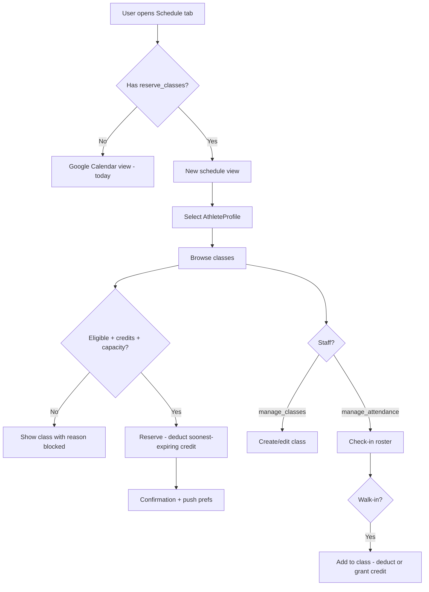

# Class Reservation System — Product Requirements Document

**Version:** 1.0 (consolidated)  
**Status:** Pre-engineering  
**Scope:** Product and UX requirements only (no implementation specifics)  
**Last updated:** 2026-08-25

---

## 1. Background and Goals

### Current state

- DC Vault has an older **website** (registration, PayPal payments, quarterly packages, discount codes) and a newer **mobile app** (Expo/React Native).
- Class scheduling today uses **Zen Planner**, which admins update manually when athletes purchase on the website. Members reserve classes in Zen Planner; the app **Schedule tab reads from Google Calendar** for the public practice schedule.
- **Users** have **Athletes** (registration/billing entity) and **AthleteProfiles** (mobile app entity, 1:1 with Athletes). A user may manage **multiple athletes** and switches between them via AthleteProfiles in the app.
- Website registration info explicitly references Zen Planner for reservations and the website calendar for schedule/cancellation updates.

### Product goal

Build a first-party **class reservation system** in the mobile app that eventually replaces Zen Planner, while maintaining continuity with website registration and the existing member experience during a long phased rollout.

### Key objectives

1. Members view schedule, reserve/cancel classes, and see participation — in-app.
2. Staff create/manage classes, check in athletes, and adjust credits when needed.
3. Website purchases flow into the new system and appear correctly in the app.
4. Zen Planner and the existing Google Calendar schedule remain operational until full release.
5. Improve visibility into attendance, remaining classes, and athlete progress.

### Success criteria (launch)

- Beta users with permission can reserve and cancel within policy constraints.
- Website registrations appear in app credit inventory without manual Zen Planner entry (target state before dark launch).
- Staff can manage classes and check-in without external tools (for beta cohort).
- No partial/broken UI for users without permission — they see today's Schedule experience unchanged.

### Phasing philosophy

This is a **multi-phase, multi-session project**. Requirements below distinguish **MVP (dark launch)** from **later phases**. Some engineering design tasks (credit inventory, private lesson payments) are explicitly deferred to dedicated design sessions.

---

## 2. Rollout and Coexistence

### Dark launch (beta)

- New system enabled per-user via **`reserve_classes` permission** (see §13).
- Beta testers use the new Schedule/reservation experience.
- Everyone else sees the **existing Google Calendar Schedule tab** unchanged.
- **Zen Planner continues** for non-beta users and as a fallback until full release.
- Admins continue manually updating Zen Planner for website purchases **until** the new system reliably receives website purchase data.

### Pre-dark-launch requirement

All class **configuration scenarios** (§5) must be supported before dark launch — not necessarily as named "class types," but as configurable class properties that cover every use case.

### Full release (future)

- Zen Planner retired for reservations.
- All members migrated to in-app reservations.
- Communication plan TBD.

### Platform scope

| Capability | MVP (dark launch) | Later |
|---|---|---|
| View/reserve classes in app | Beta users only | All members |
| Website registration → new system | **Required** | Required |
| In-app registration/payment | Out of scope | Full parity with website |
| Waivers / registration fields | Website handles | App parity when in-app registration ships |

---

## 3. Feature Access

### Decision: permissions only (no feature toggle system)

Use the existing permissions system. No `manage_feature_toggles` or backend toggle infrastructure.

### Member-facing gate

- Permission: **`reserve_classes`**
- When **granted**: Schedule tab shows the new class reservation experience.
- When **not granted**: Schedule tab shows the **current Google Calendar view** (today's behavior).

### Session behavior

Permission state loads with the user session and refreshes on token refresh (consistent with existing app auth patterns).

---

## 4. Schedule Tab (Member-Facing)

### Purpose

Primary interface for viewing the class schedule and reserving/canceling sessions.

### Views

- **Monthly calendar view** and **list view** — familiar patterns similar to the current schedule experience.
- Color-coded classes (see §6).
- Past vs future sessions: filterable or clearly separated (UX detail TBD during design).

### Display per class

- Title, start/end time, location, description
- Spots remaining / capacity status
- **Eligibility indicator** — if the selected athlete cannot reserve, show **why** (visible but blocked; not hidden)
- Attendance indicator for past classes (for selected athlete — see §10)
- Class note/suggestion field (e.g., pole needed — see §8)

### Actions

- **Reserve** — button and/or modal flow
- **Cancel reservation** — within policy window
- **View class details** — including roster (see below)
- **Register / buy classes** entry point when athlete has no usable credits (links to registration flow when available; for MVP, may direct to website)

### Capacity

- **Hard stop when full** — no waitlist in MVP.

### Roster visibility

- Attendee **count**, **names**, and **profile photos** visible to users with **`view_class_roster`** permission.
- MVP: grant this permission to regular members and coaches.
- Tapping a roster entry opens the athlete profile (per existing privacy rules).

### Staff actions (same screen)

Users with **`manage_classes`** can create/edit classes from the Schedule tab (see §6).

### Empty states

Copy needed for: no upcoming classes, athlete ineligible for all visible classes, athlete has no credits, feature not available (falls back to old calendar — user shouldn't normally see this state).

---

## 5. Class Configurations (Not Formal "Types")

### Approach

Do **not** build a rigid "class types" catalog for MVP. Instead, provide **configuration options** that express all current use cases. **Presets** for common setups (open class, private lesson, break, etc.) may be added later for staff efficiency.

### Configurable properties

| Property | Notes |
|---|---|
| Title | |
| Description | |
| Start / end time | |
| Location | |
| Allowed athlete groups | Fly Kids, Open/All Ages, Adult, Elite Development, etc. |
| Age limits | Optional |
| Recurrence | Weekly/multi-weekly typical; edits apply to **single instance** or **entire series** |
| Reservation cutoff | Latest time to reserve |
| Cancellation cutoff | Latest time to cancel with credit return |
| Max capacity | Single number per class/session |
| Credit cost | 0 or 1 (group class credits) |
| Dollar cost | For paid events / lessons (payment model TBD — see §7) |
| Visibility | Hidden vs visible on member schedule |
| Color | Manual or default from athlete group |
| `isReservable` | `false` for display-only items (meets, breaks) |
| Requires approval | For private lessons — request/approve flow |
| Sends notification on reservation | Private lessons notify coach |
| Coaching staff | Multiple; coaches have athlete profiles |
| Class note / pole suggestion | Free-text note shown to members (e.g., "Bring your 14' pole") |
| Max attendees (lessons) | Configurable — supports private → semi-private adjustment |

### Behaviors by use case

| Use case | MVP behavior |
|---|---|
| Open / all-ages classes | Reservable; group restrictions via config |
| Age-restricted / group-specific | Reservable; eligibility enforced |
| Private lessons | Reservable with approval; coach notified; max attendees configurable |
| Semi-private lessons | Same as private; staff increases capacity as needed |
| Meets | **Visible only, not reservable** |
| DC Vault hosted events | Configurable cost; reservable if `isReservable` |
| Non-bookable items (breaks) | Visible, not reservable |
| Community events | Free (`credit cost = 0`), sign-up if reservable |

### Recurrence editing

- Edit **this occurrence only** or **entire series**.
- Design series-wide reservation/pole updates with future bulk-update in mind (§8) — don't paint into a corner, but bulk update is **not MVP**.

### Duplication

- Staff can **copy settings from an existing class** to speed setup.

### Staff UX

- Create/edit via **bottom sheet** or modal.
- Large touch targets; mobile-first admin UX.

---

## 6. Google Calendar Integration

### Source of truth

The **app/backend class system is the source of truth** for beta users.

### During transition

- The **existing public Google Calendar** (website practice schedule) is **maintained separately** by staff — unchanged workflow for non-beta members.
- Classes created in the new system **sync one-way to a separate Google Calendar** (not the existing public one) to avoid duplicate events during testing.

### Future goals (not MVP)

- Members subscribe/resync **personal calendar** (Apple/Google) with their reservations.
- Un-reserving removes the event from their personal calendar.
- Evaluate whether the public website calendar eventually reads from the new system instead of manual Google Calendar maintenance.

---

## 7. Registration, Packages, and Credits

### Core model: flexible expiration with quarter overlay

Build the credit system on a **flexible expiration model**:

- Each package has: **credit count**, **expiration date**, optional **start date**, optional **no expiration** (unlimited).
- **Quarter-bound behavior** is a policy layer: set expiration to end-of-quarter. This layer can be removed later without rewriting the core model.

### Entity relationships

- Credits belong to **Athletes** (not AthleteProfiles).
- App UX operates through **AthleteProfile selection** (user switches profile → underlying Athlete).
- Multiple athletes per user: all reservation/registration flows respect the **currently selected AthleteProfile's Athlete**.

### Website registration (MVP requirement)

- Purchases on the **website** must create/update package/credit records in the new system.
- App displays remaining classes, expiration, and purchase history for website-registered athletes.
- Zen Planner manual credit entry continues in parallel until full cutover.

### In-app registration (later)

- Entry points (when built): Schedule tab, athlete profile, out-of-credits prompts.
- Must eventually achieve **full parity** with website registration (packages, waivers, fields, discounts, PayPal).
- **Not MVP.**

### Multiple packages

- Athletes may hold **multiple active packages** (e.g., bought more when running low).
- **Deduction rule (MVP):** consume credit from the package **expiring soonest** among eligible packages (respecting start dates).
- **Display:** show **sum of remaining credits** across active packages for the current period, with expiration info for the soonest-expiring relevant package.

### Package start date

- Packages may have an optional **start date** — credits unusable until then.
- Supports **early purchase for next quarter** — those credits only apply to classes on/after the start date.

### Unlimited packages (MVP)

- Admin can assign a package with **no expiration** and effectively unlimited credits (or a very high count — engineering TBD).
- Required for MVP because it's a natural extension of the flexible model.

### Private lessons and dollar purchases

- **Engineering design task (pre-implementation):** define credit inventory vs one-time purchase for private/semi-private lessons.
- Direction: private lesson purchases may only apply to private lesson slots; may **not use the group credit pool** — possibly one-time PayPal charges instead of credits.
- **Payment timing:** charge at **approval** preferred for approval-required lessons; **charge at reservation** acceptable for MVP if simpler.

### Discount codes

- MVP: **no changes** — existing website discount system and rules apply to website purchases.
- No in-app discount management (`manage_discounts` not needed for MVP).
- When in-app registration ships later, discount validation must match website behavior.

### Refunds (MVP)

- **Out of scope.** Coach handles money manually; admin adjusts credits via **`manage_credits`**.

### Active member status

An athlete is an **active member** if they have purchased a package for the current period (even if all credits are used).

- Unlocks existing app behaviors tied to registration (e.g., log access).
- Edge case: refunded purchase ending active status — handle manually for MVP.

---

## 8. Reservations

### Prerequisites to reserve

1. Selected athlete has **unused, non-expired credits** of the applicable type (group credits for group classes; private lesson payment rules TBD).
2. Current time is **before reservation cutoff**.
3. Athlete meets **eligibility** (training group, age, etc.).
4. Class is **`isReservable = true`** and **not full**.
5. Package **start date** has passed (if set).

### Credit consumption

- Reserving deducts 1 credit (or configured cost) from the **soonest-expiring eligible package**.
- Display: "X classes remaining" and "Expires [date]" (soonest relevant expiration).

### Cancellation

- **Within cancellation cutoff:** credit returned to the package it came from.
- **After cutoff:** credit **forfeited**.
- MVP: no automatic admin override of cutoff — admin **manually adds a credit** via `manage_credits` if excused.

### Pole / equipment (MVP)

- No structured pole-selection system for MVP.
- Class may include a **note/suggestion field** (e.g., "Bring 14' pole for step 5").
- Member reservation may include a **free-text note** field (storage TBD in engineering design).
- **Future:** structured pole selection, multi-pole preference order, bulk series updates, pinned-pole quick-select.

### Reservation management

- View upcoming reservations (per athlete).
- Update/cancel before cutoff.
- **Bulk/multi-class reservation:** later phase.

### Admin on behalf of member

- Staff with **`manage_classes`** can **cancel a member's reservation** (e.g., no-show shouldn't consume credit unfairly — admin restores credit separately via `manage_credits`).

### No-show handling

- No explicit "mark no-show" action.
- Athlete with a reservation who is **not checked in** = no-show; credit already consumed at reservation.
- Admin restores credit manually if appropriate.

### Notifications

- Member notified (push) when admin changes their reservation or credits (see §12).

---

## 9. Admin Credit and Reservation Management

### Permission: `manage_credits` (separate from `manage_classes`)

| Action | MVP |
|---|---|
| Add credits to athlete | Yes |
| Remove credits from athlete | Yes |
| Cancel reservation on behalf of user | Yes (`manage_classes`) |
| Restore credit after late cancel | Same as add credits |
| Override cutoff / eligibility | **No** — future |
| Optional note/reason on actions | **No** — future |
| Audit log | **No** — future |
| Notify user on credit/reservation change | **Yes** (push) |

### Entry points

- Athlete profile (admin view)
- Class roster / class detail (staff view)

---

## 10. Athletes, Profiles, and Progress

### Training group

- New property on **AthleteProfile**: `trainingGroup`.
- **Not editable by the athlete/user themselves.**
- Editable by users with a dedicated permission (e.g., **`edit_training_group`** — may or may not be assigned to coach role).
- If unset, fall back to group from latest purchase or a default (engineering TBD).

### Profile displays (current quarter)

- **Classes attended** (current quarter)
- **Classes remaining** — sum across active packages
- **Progress visualization** — semicircle meter (remaining vs total purchased for quarter)
- **Expiration timing** for soonest-expiring package

### History (in-app list)

Filterable by date range. Event types:

- Credits purchased / added
- Class attended (checked in)
- Class missed (reserved, not checked in)
- Credits expired unused

Export (PDF/CSV): **later**.

### Schedule integration

- On the Schedule tab, indicate which classes the **selected athlete attended** (visual marker on past sessions).

### Multi-athlete users

- User switches AthleteProfile in app → all schedule, credits, reservations, and history reflect that athlete.
- Registration/reservation always tied to the selected athlete.

---

## 11. Check-In (Attendance)

### Permission: `manage_attendance`

### Requirements

- Coach opens check-in for a **class session** from the app on their **personal device**.
- View class roster (reserved athletes).
- **Tap to mark present** — fast, minimal friction.
- Check-in tied to **reservation** when one exists.

### Walk-ins

- Athlete showed up but has no reservation: staff can **add them to the class** and **deduct a credit**.
- If athlete has no credits: staff uses **`manage_credits`** to grant a credit, then signs them up (or system combines grant + deduct in one flow — engineering TBD).

### Out of scope (MVP)

- Late arrival distinction
- Athlete self-check-in
- Kiosk/tablet mode

---

## 12. Messaging and Notifications

### Class-scoped messaging

- Staff can **message all participants** in a class (reserved roster) using the **existing messaging infrastructure**.

### Automated notifications (MVP: push only)

Trigger automated push when:

- Class **canceled**
- Class **time changed**
- Class **location changed**

- Optional custom message/reason from admin when sending.
- Recipients: users with athletes reserved for that class.

### Skeleton for later

- Code structure should accommodate **email** and **SMS** channels (TODO stubs, not MVP implementation).

### Out of scope (MVP, include as later requirement)

- **Class reminders** before start (e.g., 24h push)
- Member opt-out of class messages separate from general comms

---

## 13. Permissions Summary

| Permission | Purpose | MVP |
|---|---|---|
| `reserve_classes` | Access new Schedule/reservation experience | Yes |
| `manage_classes` | Create/edit classes; cancel reservations on behalf of users; approve private lessons | Yes |
| `manage_credits` | Manually add/remove athlete credits | Yes |
| `manage_attendance` | Check-in interface | Yes |
| `view_class_roster` | See attendee names/photos on class detail | Yes |
| `edit_training_group` | Change athlete training group on profile | Yes |
| ~~`manage_feature_toggles`~~ | — | Not used |
| ~~`manage_discounts`~~ | — | Deferred (website system) |

### Roles (informal)

- **Admin:** all permissions.
- **Coaches:** typically `manage_attendance`; may also get `manage_classes`, `manage_credits`, `edit_training_group`, `view_class_roster` — assign per person.

---

## 14. Engineering Quality Requirements

### Automated testing (project requirement)

- **Unit tests required** for both **backend** (`dcvault/server/`) and **mobile app** (`polevaultapp/DCVault/`).
- Test framework selection is a **separate engineering task** (no existing framework in use).
- Tests should cover core business logic: credit deduction order, expiration/start-date rules, eligibility, cancellation credit return, reservation capacity, permission gating.

### Deferred engineering design tasks

1. **Credit inventory architecture** — group credits vs private lesson purchases vs dollar charges; package schema; linkage to website purchases.
2. **Private/semi-private payment flow** — charge at approval vs reservation; PayPal integration points.
3. **Reservation note / pole field storage** — free-text now, structured later.
4. **Website purchase → new system sync** — exact integration with existing `Purchases` / `Packages` tables.

---

## 15. MVP vs Later Phases

### MVP (dark launch checklist)

- [ ] Permission-gated new Schedule experience; fallback to Google Calendar
- [ ] Class CRUD with full configuration options (§5)
- [ ] Flexible credit/package model with quarter overlay, start dates, unlimited packages
- [ ] Website purchase → credit sync
- [ ] Reserve / cancel with cutoff rules and hard capacity stop
- [ ] Eligibility visible-with-reason
- [ ] Multi-package deduction (soonest expiring)
- [ ] Multi-athlete per user via profile switching
- [ ] Check-in with walk-in support
- [ ] Admin credit add/remove; admin cancel reservation
- [ ] Push notifications (class changes, admin credit/reservation changes)
- [ ] Class participant messaging
- [ ] Roster visibility (permission-gated)
- [ ] Athlete profile: training group, quarter progress, history, schedule attendance markers
- [ ] One-way sync to separate Google Calendar
- [ ] Unit test framework + core logic tests

### Phase 2+ (prioritize later)

- In-app registration with website parity
- Waitlist
- Meets reservation workflows
- Structured pole selection + bulk series updates
- Bulk/multi-class reservation
- Override cutoff and eligibility (admin)
- Audit log and action notes
- Email and SMS notifications
- Class reminders before start
- Personal calendar subscription (add/remove on reserve/unreserve)
- Registration discount management in app
- Refund/chargeback automation
- Class configuration presets / "types" UI
- Attendance-based restrictions, dynamic pricing, analytics
- Migrate public website calendar to new system; retire Zen Planner
- History export

---

## 16. Open Questions (Remaining)

These are intentionally unresolved — capture decisions as they come up during design/build:

1. **Credit inventory for private lessons** — credits vs one-time purchases (engineering design session).
2. **Private lesson payment timing** — approval vs reservation charge (start simple, refine).
3. **Roster privacy** — confirm `view_class_roster` stays granted to all members long-term.
4. **Training group fallback** — when AthleteProfile group unset, derive from purchase or require admin set?
5. **List view defaults** — sort order, past/future separation UX.
6. **Google Calendar sync details** — which separate calendar, sync frequency, what fields map.
7. **Website → new system sync** — real-time webhook vs batch; handling of existing Purchases data model.
8. **Success metrics** — define before full release (e.g., beta reservation volume, support tickets, Zen Planner manual entry reduction).
9. **Launch communication** — member messaging when switching off Zen Planner.
10. **Test framework selection** — Jest for both? Detox/Maestro for mobile E2E later?

---

## 17. User Flow (Summary)



---

## 18. Implementation Tasks (One Session Each)

Work through these **in order** unless a task explicitly says otherwise. Each task should be completable in a single Cursor session, manually testable, and covered by unit tests where applicable.

Check off tasks by changing `[ ]` to `[x]` and adding a completion note (date + any PRD section updates) beneath the task.

### Task 0: Test infrastructure

- [ ] **0.1 — Backend test framework**
  - Set up unit test runner for `dcvault/server/` (e.g., Jest + Supertest).
  - Add npm script, one smoke test, document how to run in `dcvault/README.md` or test README.
  - _Completion notes:_

- [ ] **0.2 — Mobile test framework**
  - Set up unit test runner for `polevaultapp/DCVault/` (extend existing `__tests__/` if present).
  - Add npm script, one smoke test, document how to run.
  - _Completion notes:_

### Task 1: Permissions foundation

- [ ] **1.1 — Seed new permissions**
  - Add to `dcvault/server/db/seedPermissions.js`: `reserve_classes`, `manage_classes`, `manage_credits`, `manage_attendance`, `view_class_roster`, `edit_training_group`.
  - Assign to appropriate roles (admin gets all; document coach defaults).
  - _Completion notes:_

- [ ] **1.2 — Mobile permission helpers**
  - Add typed permission checks in mobile app (mirror existing pattern in auth/permissions).
  - _Completion notes:_

### Task 2: Credit/package data model (design + build)

- [ ] **2.1 — Credit inventory design doc**
  - Resolve open questions in §7 and §16 #1–2, #7.
  - Document schema: packages, credits, expiration, start date, unlimited, deduction order.
  - Update §16 and this task list if decisions differ from PRD.
  - _Completion notes:_

- [ ] **2.2 — Database schema + models**
  - Sequelize models/migrations for credit/package tables in `dcvault/server/db/`.
  - _Completion notes:_

- [ ] **2.3 — Credit business logic + unit tests**
  - Core functions: add/remove credits, deduct (soonest expiring), expiration/start-date checks, unlimited packages.
  - _Completion notes:_

### Task 3: Website purchase sync

- [ ] **3.1 — Purchase → credit sync**
  - Hook existing website registration/PayPal flow to create/update credit packages.
  - Backfill or migration strategy for existing purchases (if needed).
  - Unit tests for sync logic.
  - _Completion notes:_

### Task 4: Class data model + API

- [ ] **4.1 — Class schema + recurrence**
  - Models for classes, series, occurrences; all configurable properties from §5.
  - _Completion notes:_

- [ ] **4.2 — Class CRUD API + unit tests**
  - Mobile-authenticated routes; permission checks (`manage_classes`).
  - Single-instance vs series edit behavior.
  - _Completion notes:_

### Task 5: Google Calendar outbound sync

- [ ] **5.1 — Separate calendar sync**
  - One-way push from app/backend to dedicated Google Calendar (not the public one).
  - Resolve §16 #6 during implementation; document config (calendar ID, credentials).
  - _Completion notes:_

### Task 6: Schedule tab — permission gate + read-only UI

- [ ] **6.1 — Schedule tab gate**
  - If no `reserve_classes`: existing `CalendarCustom` / Google Calendar view.
  - If yes: new schedule component shell.
  - _Completion notes:_

- [ ] **6.2 — Schedule display (read-only)**
  - Monthly + list views; class details; capacity; eligibility with reason; attendance markers for past classes.
  - Mobile API client + hooks.
  - _Completion notes:_

### Task 7: Reservations

- [ ] **7.1 — Reservation API + unit tests**
  - Reserve, cancel, cutoff rules, capacity hard stop, credit deduction/return.
  - Free-text reservation note field (MVP).
  - _Completion notes:_

- [ ] **7.2 — Reservation UI**
  - Reserve/cancel flows, confirmation, blocked-state messaging, upcoming reservations list.
  - _Completion notes:_

### Task 8: Admin class management UI

- [ ] **8.1 — Create/edit class bottom sheet**
  - All §5 properties; copy from existing class; series edit scope.
  - _Completion notes:_

- [ ] **8.2 — Private lesson approval flow**
  - Request → approve/deny; coach notification; payment hook stub if not ready (see §7).
  - _Completion notes:_

### Task 9: Admin credits UI

- [ ] **9.1 — manage_credits API** (if not fully covered in Task 2)
  - Add/remove credits; push notification on change.
  - _Completion notes:_

- [ ] **9.2 — manage_credits UI**
  - Entry points: athlete profile, class roster.
  - _Completion notes:_

### Task 10: Check-in

- [ ] **10.1 — Check-in API + unit tests**
  - Mark present; walk-in add + credit deduct; tie to reservation.
  - _Completion notes:_

- [ ] **10.2 — Check-in UI**
  - Fast tap interface per class session.
  - _Completion notes:_

### Task 11: Athlete profile updates

- [ ] **11.1 — trainingGroup on AthleteProfile**
  - Schema, API, `edit_training_group` permission gate.
  - _Completion notes:_

- [ ] **11.2 — Progress + history UI**
  - Semicircle meter, quarter stats, history list, schedule attendance markers.
  - _Completion notes:_

### Task 12: Roster + messaging + notifications

- [ ] **12.1 — Class roster UI**
  - Permission-gated names/photos; link to profiles.
  - _Completion notes:_

- [ ] **12.2 — Class change notifications**
  - Push on cancel, time change, location change; optional admin message.
  - Skeleton TODOs for email/SMS.
  - _Completion notes:_

- [ ] **12.3 — Message class participants**
  - Integrate with existing messaging system.
  - _Completion notes:_

### Task 13: Dark launch readiness

- [ ] **13.1 — End-to-end beta test pass**
  - Grant `reserve_classes` to test users; verify Zen Planner + old calendar still work for others.
  - Run full unit test suite; document manual test checklist.
  - _Completion notes:_

- [ ] **13.2 — Update MVP checklist (§15)**
  - Mark all completed items; file remaining gaps as new tasks or Phase 2.
  - _Completion notes:_

---

## 19. Agent Instructions (Read Every Session)

**Purpose:** This document is the single source of truth for the Class Reservation System. Every Cursor agent session working on this feature should read this file first.

### Before starting work

1. Read **`dcvault/docs/CLASS_RESERVATION_SYSTEM.md`** (this file) in full, especially:
   - §18 Implementation Tasks — find the **first unchecked task**
   - §16 Open Questions — check if your task resolves any; update the PRD if so
   - §15 MVP checklist — understand overall progress
2. Read workspace **`AGENTS.md`** for repo layout (`dcvault/` backend vs `polevaultapp/DCVault/` mobile).
3. Confirm with the user which **task number** they want to tackle this session (default: next unchecked in §18).

### During the session

1. **Scope to one task** (or one sub-task, e.g. 7.1) — do not bleed into the next task unless the user asks.
2. **Write unit tests** for business logic added in that task (see §14).
3. Follow existing codebase conventions in each repo (Node 16 / Sequelize in `dcvault/`; Node 24 / Expo / TypeScript in `polevaultapp/`).
4. If a product decision is required and not covered here, **ask the user** before implementing. Do not guess on business rules.
5. If implementation forces a PRD change, **note it** for the update step below.

### After completing a task

1. **Check off the task** in §18: change `[ ]` to `[x]`.
2. Add **completion notes** under the task: date, brief summary, any deviations.
3. **Update this PRD** if anything changed:
   - Revise affected sections (don't leave contradictions).
   - Move resolved items out of §16 Open Questions.
   - Add new open questions if discovered.
   - Update §15 MVP checklist if applicable.
4. Bump **Last updated** at the top of this file.
5. Tell the user what to **manually test** and which **test commands** to run.

### What not to do

- Do not remove or skip Zen Planner / existing Google Calendar behavior until Task 13+ and explicit user approval for full release.
- Do not implement Phase 2+ items (§15) unless the user explicitly expands scope.
- Do not commit unless the user asks.

### Suggested session prompt (for the user)

Copy and adapt this when starting a new agent session:

```
Read dcvault/docs/CLASS_RESERVATION_SYSTEM.md (especially §18 Agent Instructions).
Implement Task [X.Y — task name].
When done: check off the task, update the PRD with any decision changes, and give me manual test steps + test commands.
```
